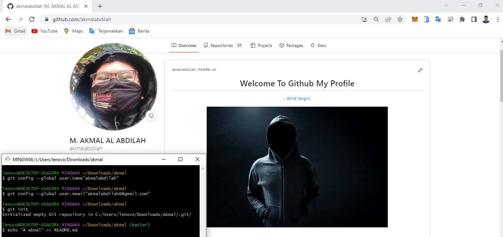
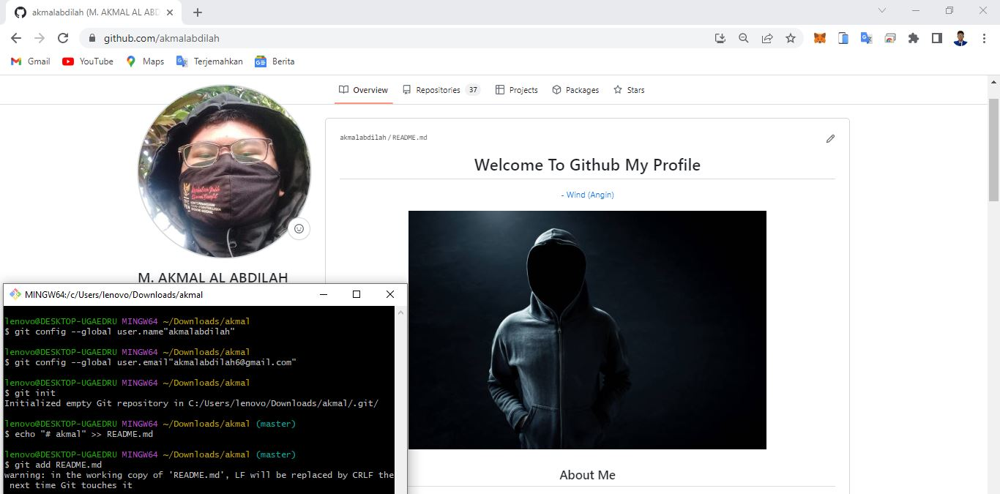
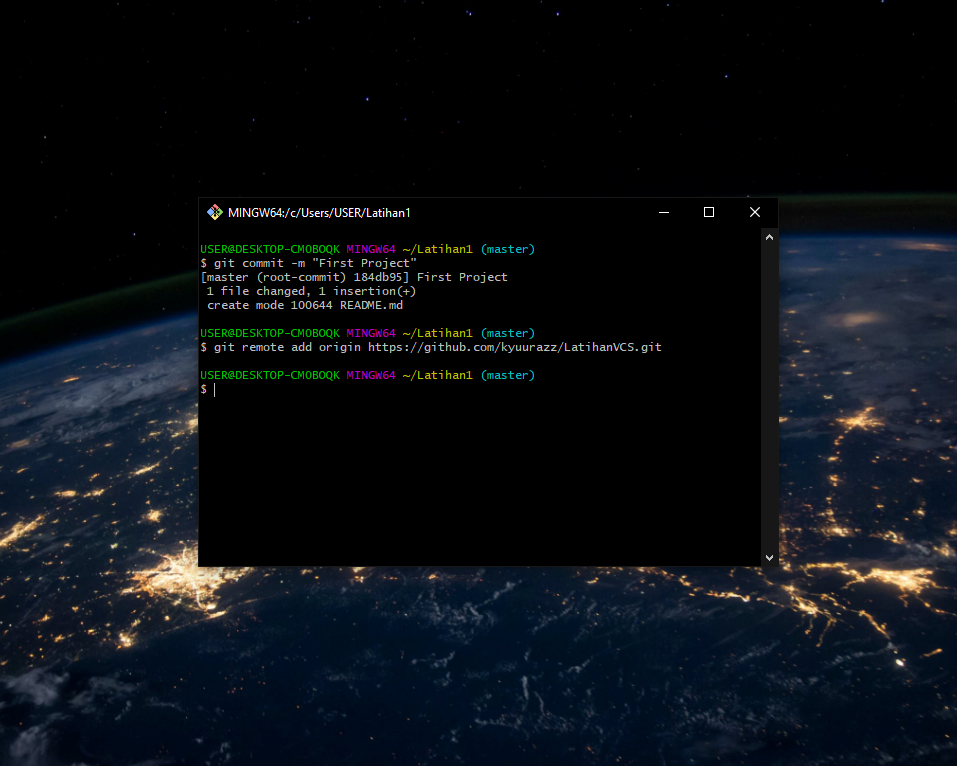
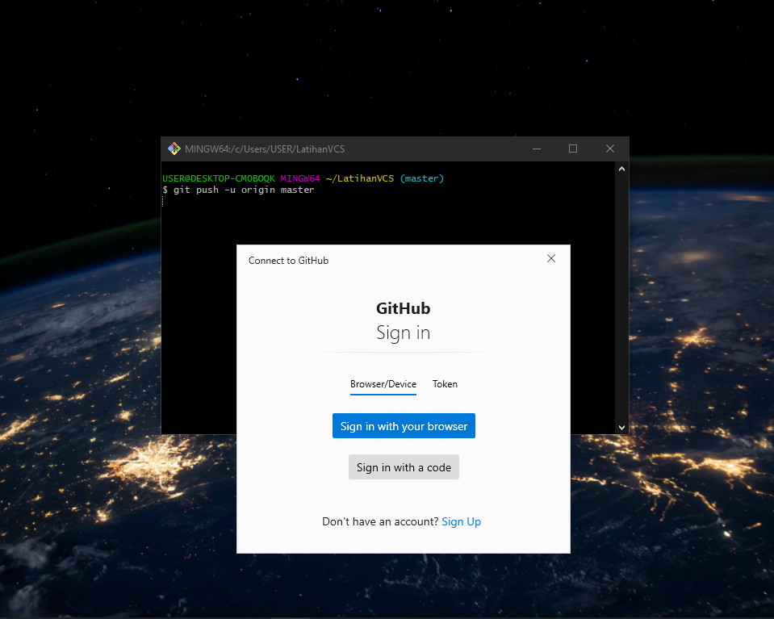
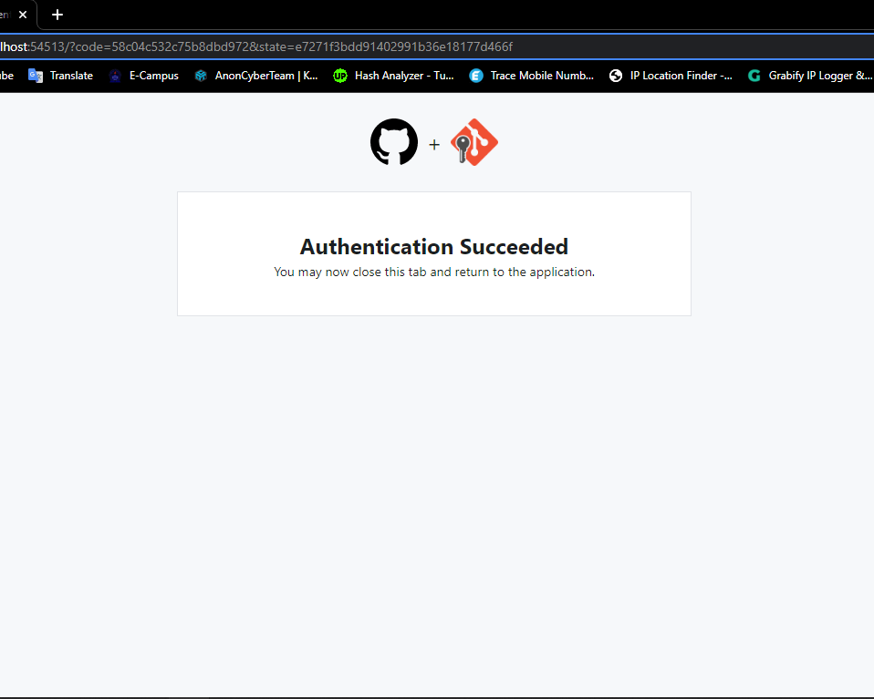
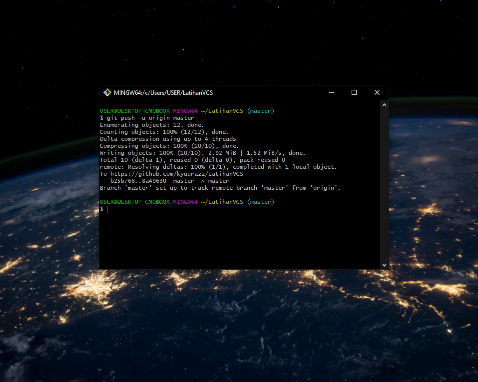

## Latihan Menggunakan Git
## TUTORIAL MENGGUNAKAN GIT

<p align="center">
 
</p>
<p align="center">
<a href="https://github.com/akmalabdilah"></a>
<p align="center">

<p align="center">
<a href="https://github.com/akmalabdilah/tugas-permogra#Requirements">Requirements</a> •
<a href="https://github.com/akmalabdilah/tugas-permogra#informasi-git">Informasi</a> •
<a href="https://github.com/akmalabdilah/tugas-permogra#Tutorial">Tutorial</a>
</p>
</div>

# Requirements
- [Git](https://git-scm.com/download)

# Informasi Git
Apa itu Git?
<p>
Git merupakan software berbasis Version Control System (VCS) yang bertugas untuk mencatat perubahan seluruh file atau repository suatu project. Developer software biasa menggunakan Git untuk distributed revision (VCS terdistribusi), hal ini bertujuan untuk menyimpan database tidak hanya ke satu tempat. Namun semua orang yang terlibat dalam penyusunan kode dapat menyimpan database ini.
</p>

# Tutorial
- Pada saat pertama kali menggunakan Git, perlu dilakukan konfigurasi
Username dan Email. Jalankan perintah berikut:
```bash
> git config --global user.name "username"
> git config --global user.email "email"
```


- Jalankan perintah git init. untuk membuat repository local
```bash
> git init
```


- Untuk membuat file dapat menggunakan Text Editor, Lalu menyimpan
filenya pada repository. Sebagai contoh disini saya akan membuat file README.md dengan perintah berikut
```bash
> echo "# Latihan1" >> README.md
```


- Untuk menambahkan file yang sudah kita buat, gunakan perintah git add (Nama File) atau bisa menggunakan git add . (Jika file nya ada banyak)
```bash
> git add README.md
> git add .
```


- Untuk menyimpan perubahan yang ada kedalam database repository
local, gunakan perintah git commit -m "nama project"
- Dan yang ada di dalam tanda kutip " " itu nama project kita dan jangan sama setiap kali kita upload project
```bash
> git commit -m "First Project"
```


- Untuk menyimpan setiap perubahan pada repository local, gunakan perintah git remote add origin (url)
```bash
> git remote add origin https://github.com/kyuurazz/LatihanVCS.git
```


- Untuk mengirim perubahan pada repository local ke server, gunakan perintah git push
- Perintah ini akan meminta Username dan Password pada akun github mu atau klik Sign in with your browser
```bash
> git push -u origin master
```


- Jika sudah berhasil, maka tampilan nya akan seperti dibawah ini


- Dan file sudah berhasil di upload ke Github anda


- Selesai


<div>
<h2 align="center">Thanks For Reading!!!</h2>
<div align="center">

